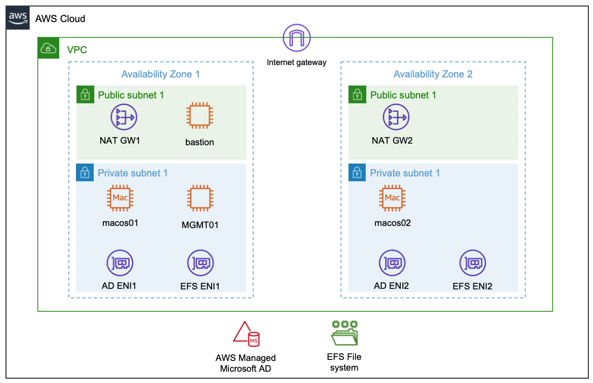
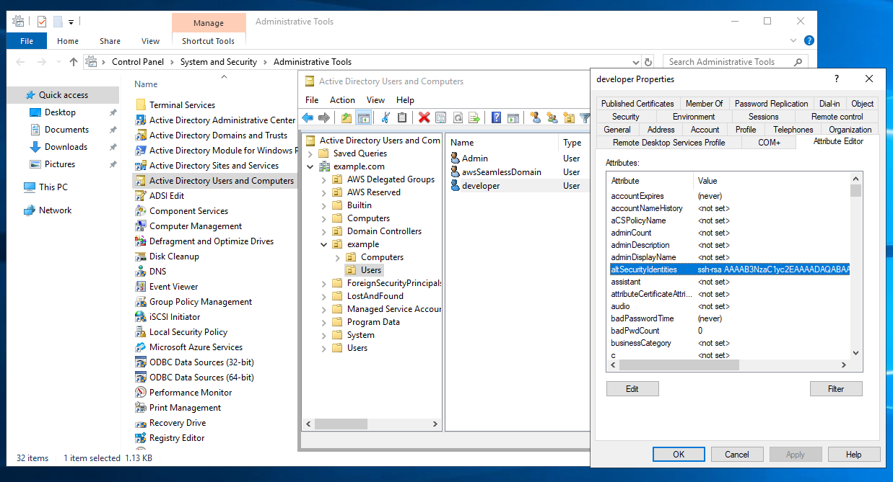
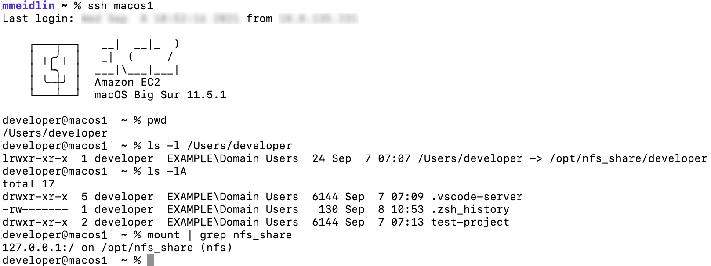
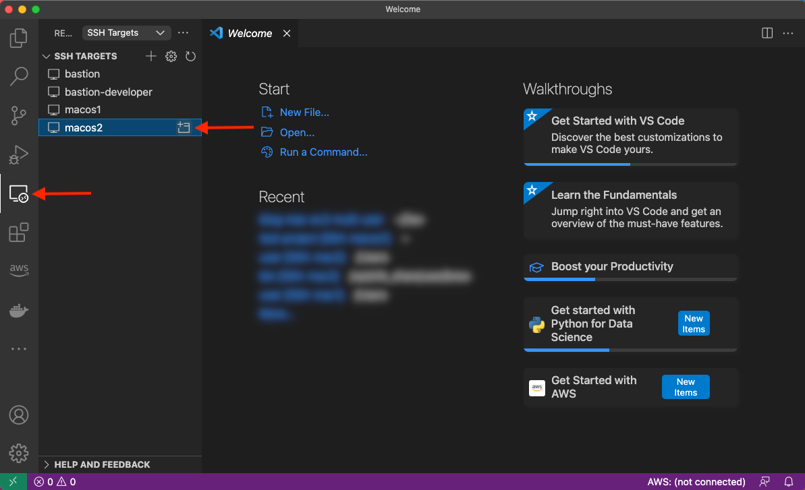
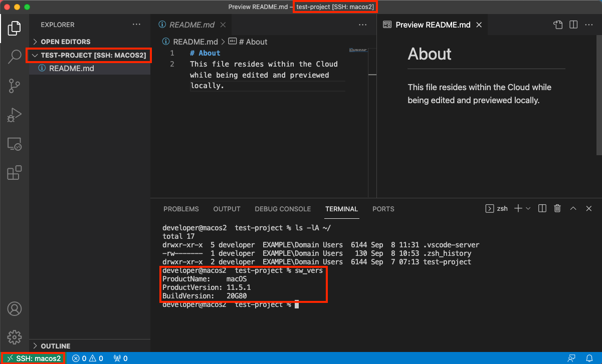

# Setting up EC2 Mac instances as shared remote development environments

## About
This example corresponds to the AWS Compute Blog Post [_Setting up EC2 Mac instances as shared remote development environments_](https://aws.amazon.com/blogs/compute/setting-up-ec2-mac-instances-as-shared-remote-development-environments/).

It demonstrates how [EC2 Mac instances](https://aws.amazon.com/ec2/instance-types/mac/) can be set up as remote development servers that can be accessed by multiple developers concurrently in order to compile and run their code interactively via command line access. The proposed setup features centralized user management based on [AWS Directory Service](https://aws.amazon.com/directoryservice/) and shared network storage utilizing [Amazon Elastic File System (Amazon EFS)](https://aws.amazon.com/efs/), thereby decoupling those aspects from the development server instances. As a result, new instances can easily be added when needed, and existing instances can be updated to the newest OS and development toolchain version without affecting developer workflow.

## Table of Contents
- [Setting up EC2 Mac instances as shared remote development environments](#setting-up-ec2-mac-instances-as-shared-remote-development-environments)
    - [About](#about)
    - [Table of Contents](#table-of-contents)
    - [Architecture](#architecture)
        - [Compute Layer](#compute-layer)
        - [Storage Layer](#storage-layer)
        - [Identity Layer](#identity-layer)
        - [Access Layer](#access-layer)
    - [Prerequesites](#prerequesites)
    - [Solution Deployment](#solution-deployment)
    - [Solution Test](#solution-test)
        - [Create an Active Directory User](#create-an-active-directory-user)
        - [Connect to the EC2 Mac instances](#connect-to-the-ec2-mac-instances)
    - [Cleanup](#cleanup)
    - [Summary](#summary)
- [Security](#security)
- [License](#license)


## Architecture
The following diagram shows the architecture rolled out in the context of this example:


### Compute Layer
The compute layer consists of two EC2 Mac instances running in isolated private subnets in different Availability Zones. In a production setup, these instances are provisioned with every necessary tool and software needed by developers to build and test their code for Apple platforms. Provisioning can be accomplished by [creating custom Amazon Machine Images (AMIs)](https://aws.amazon.com/blogs/compute/building-amazon-machine-images-amis-for-ec2-mac-instances-with-packer/) for the EC2 Mac instances or by bootstrapping them with setup scripts. This example utilizes Amazon provided AMIs with macOS BigSur without custom software. Once setup, developers gain command line access to the instances via SSH and utilize them as remote development environments.

### Storage Layer
The architecture promotes the decoupling of compute and storage so that EC2 Mac instances can be updated with new OS and/or software versions without affecting the developer experience or data. Home directories reside on a highly available [Amazon EFS](https://aws.amazon.com/efs/) file system, and they can be consistently accessed from all EC2 Mac instances. From a user perspective, any two EC2 Mac instances are alike, in that the user experiences the same configuration and environment (e.g., shell configurations such as `.zshrc`, VSCode remote extensions `.vscode-server`, or other tools and configurations installed within the user's home directory). The file system is exposed to the private subnets via redundant mount target [ENIs](https://docs.aws.amazon.com/AWSEC2/latest/UserGuide/using-eni.html) and persistently mounted on the Mac instances.

### Identity Layer
For centralized user and access management, all instances in the architecture are part of a common Active Directory domain based on [AWS Managed Microsoft AD](https://docs.aws.amazon.com/directoryservice/latest/admin-guide/directory_microsoft_ad.html). This is exposed via redundant ENIs to the private subnets containing the Mac instances.
To manage and configure the Active Directory domain, a Windows Instance (`MGMT01`) is deployed. For this example, we will connect to this instance for setting up Active Directory users. Note: other than that, this instance is not required for operating the solution, and it can be shut down both for reasons of cost efficiency and security. 

### Access Layer
The access layer constitutes the entry and exit point of the setup. For this example, it is comprised of an internet-facing bastion host connecting authorized Active Directory users to the Mac instances, as well as redundant [NAT gateways](https://docs.aws.amazon.com/vpc/latest/userguide/vpc-nat-gateway.html) providing outbound internet connectivity.

Depending on customer requirements, the access layer can be realized in various ways. For example, it provides access to customer on-premises networks by using 
[AWS Direct Connect](https://aws.amazon.com/directconnect/) 
or 
[AWS Virtual Private Network (AWS VPN)](https://aws.amazon.com/vpn/), 
or to services in different Virtual Private Cloud (VPC) networks by using [AWS PrivateLink](https://aws.amazon.com/privatelink). This means that you can integrate your Mac development environment with pre-existing development-related services, such as source code and software repositories or build and test services.

## Prerequesites
We utilize [AWS CloudFormation](https://aws.amazon.com/cloudformation/) to automatically deploy the entire setup in the preceding description. Go ahead and obtain templates and code from the [GitHub repository](https://github.com/aws-samples/ec2-mac-remote-dev-env). To complete the setup, you need
* An AWS Account with sufficient permissions
* A computer/virtual machine with
  - the [AWS Command Line Interface (CLI)](https://aws.amazon.com/cli/) installed and setup
  - a Unix Shell (e.g., bash or zsh) and git installed
  - an SSH client supporting the [ssh_config](https://man7.org/linux/man-pages/man5/ssh_config.5.html) file syntax (ideally openssh)
  - a [Remote Desktop client](https://docs.microsoft.com/en-us/windows-server/remote/remote-desktop-services/clients/remote-desktop-clients)
  - (Optional) [VSCode](https://code.visualstudio.com/) with [Remote SSH Extension](https://marketplace.visualstudio.com/items?itemName=ms-vscode-remote.remote-ssh) installed and configured 

> :warning: WARNING: Deploying this example will incur AWS service charges of at least 50$ due to the fact that EC2 Mac instances can only be released 24 hours after allocation.

## Solution Deployment
In this section, we provide a step-by-step guide for deploying the solution. We will mostly rely on AWS CLI and shell scripts provided along with the CloudFormation templates and use the AWS Management Console for checking and verification only.
1. **Get the Code**: Obtain the CloudFormation templates and all relevant scripts and assets via git:
    ```shell
    git clone https://github.com/aws-samples/ec2-mac-remote-dev-env.git
    cd ec2-mac-remote-dev-env
    git submodule init 
    git submodule update
    ```
2. **Create an Amazon Simple Storage Service (Amazon S3) deployment bucket and upload assets for deployment**: CloudFormation templates and other assets are uploaded to this bucket in order to deploy them. To achieve this, run the `upload.sh` script in the repository root, accepting the default bucket configuration as suggested by the script:
    ```shell
    ./upload.sh
    ```
3. **Create an SSH Keypair for admin Access**: To access the instances deployed by CloudFormation, create an SSH keypair with name mac-admin, and then import it with EC2:
    ```shell
    ssh-keygen -f ~/.ssh/mac-admin
    aws ec2 import-key-pair \
        --key-name "mac-admin" \
        --public-key-material fileb://~/.ssh/mac-admin.pub
    ````
4. **Create CloudFormation Parameters file**: Initialize the `parameters.json` file by copying the provided template `parameters-template.json` :
    ```shell
    cp parameters-template.json parameters.json
    ```
    * `<YourS3BucketName>`: The unique name of the S3 bucket you created in step 2.
    * `<YourSecurePassword>`: Active Directory domain admin password. This must be between 8-32 characters long and can contain numbers, letters and symbols.
	* `<YourMacOSAmiID>`: We used the latest macOS BigSur AMI at the time of writing with AMI ID `ami-0c84d9da210c1110b` in the `us-east-2` Region. You can obtain other AMI IDs for your desired AWS Region and macOS version [from the console](https://console.aws.amazon.com/ec2/v2/home#Images:visibility=public-images;platform=mac;name=amzn-ec2-macos;sort=name). 
    * `<MacHost1ID>` and `<MacHost2ID>`: See the next step 5. on how to allocate Dedicated Hosts and obtain the host IDs.
5. **Allocate Dedicated Hosts**: EC2 Mac Instances run on Dedicated Hosts. Therefore, prior to being able to deploy instances, Dedicated Hosts must be allocated. We utilize `us-east-2` as the target Region, and we allocate the hosts in the Availability Zones `us-east-2b` and `us-east-2c`:
    ```shell
    aws ec2 allocate-hosts \
        --auto-placement off \
        --region us-east-2 \
        --availability-zone us-east-2b \
        --instance-type mac1.metal \
        --quantity 1 \
        --tag-specifications 'ResourceType=dedicated-host,Tags=[{Key=Name,Value=MacHost1}]'

    aws ec2 allocate-hosts \
        --auto-placement off \
        --region us-east-2 \
        --availability-zone us-east-2c \
        --instance-type mac1.metal \
        --quantity 1 \
        --tag-specifications 'ResourceType=dedicated-host,Tags=[{Key=Name,Value=MacHost2}]'
    ```
6. **Deploy the CloudFormation Stack**: To deploy the stack with the name `ec2-mac-remote-dev-env`, run the provided `deploy.sh` script as follows:
    ```shell
    ./deploy.sh ec2-mac-remote-dev-env
    ```
Stack deployment can take up to 1.5 hours, which is due to the Microsoft Managed Active Directory, the Windows `MGMT01` instance, and the Mac instances being created sequentially. Check the [CloudFormation Console](https://console.aws.amazon.com/cloudformation/) to see whether the stack finished deploying. In the console, under **Stacks**, select the stack name from the preceding code (**ec2-mac-remote-dev-env**), and then navigate to the **Outputs** Tab. Once finished, this will display the public DNS name of the bastion host, as well as the private IPs of the Mac instances. You need this information in the upcoming section in order to connect and test your setup.

## Solution Test
Now you can log in and explore the setup. We will start out by creating a developer account within Active Directory and configure an SSH key in order for it to grant access.

### Create an Active Directory User

#### Create an SSH Key for the Active Directory User and configure SSH Client
First, we create a new SSH key for the developer Active Directory user. Utilize OpenSSH CLI,
```shell
ssh-keygen -f ~/.ssh/mac-developer
```
Furthermore, utilizing the connection information from the CloudFormation output, setup your `~/.ssh/config` to contain the following entries, where `$BASTION_HOST_PUBLIC_DNS`, `$MAC1_PRIVATE_IP` and `$MAC2_PRIVATE_IP` must be replaced accordingly.
```ssh-config
Host bastion
  HostName $BASTION_HOST_PUBLIC_DNS
  User ec2-user
  IdentityFile ~/.ssh/mac-admin

Host bastion-developer
  HostName $BASTION_HOST_PUBLIC_DNS
  User developer
  IdentityFile ~/.ssh/mac-developer

Host macos1
  HostName $MAC1_PRIVATE_IP
  ProxyJump %r@bastion-developer
  User developer
  IdentityFile ~/.ssh/mac-developer

Host macos2
  HostName $MAC2_PRIVATE_IP
  ProxyJump %r@bastion-developer
  User developer
  IdentityFile ~/.ssh/mac-developer
```
As you can see from this configuration, we set up both SSH keys created during this tutorial. The `mac-admin` key that you created earlier provides access to the privileged local ec2-user account, while the `mac-developer` key that you just created grants access to the unprivileged AD developer account. We will create this next.

#### Login to the Windows MGMT Instance and setup a developer Active Directory account
Now login to the bastion host, forwarding port 3389 to the `MGMT01` host in order to gain Remote Desktop Access to the Windows management instance:
```shell
ssh -L3389:mgmt01:3389 bastion
```
While having this connection open, launch your Remote Desktop Client and connect to `localhost` with Username `admin` and password as specified earlier in the CloudFormation Parameters. Once connected to the instance, open **Control Panel>System and Security>Administrative Tools** and click **Active Directory Users and Computers**. Then, in the appearing window, enable **View>Advanced Features**. If you haven’t changed the Active Directory domain name explicitly in CloudFormation, then the default domain name is example.com with corresponding NetBIOS Name example. Therefore, to create a new user for that domain, select **Active Directory Users and Computers>example.com>example>Users**, and click **Create a new User**. In the resulting wizard, set the **Full name** and **User logon name** fields to `developer`, and proceed to set a password and create the user. Once created, right-click on the developer user, and select **Properties>Attribute Editor**. Search for the **altSecurityIdentities** property, and copy-paste the developer public SSH key (contained in `~/.ssh/mac-developer.pub`) into the **Value to add** field, click **Add**, and then click **OK**. In the **Properties** window, save your changes by clicking **Apply** and **OK**. The following figure illustrates the process just described:


### Connect to the EC2 Mac instances
Now that the `developer` account is setup, you can connect to either of the two EC2 Mac instance from your local machine with this Active Directory account:
```shell
ssh macos1
```
When you connect via the preceding command, your local machine first establishes an SSH connection to the bastion host which authorizes the request against the key we just stored in Active Directory. Upon success, the bastion host forwards the connection to the `macos1` instance, which again authorizes against Active Directory and launches a  terminal session upon success. The following figure illustrates the login with the macos1 instance, showcasing both the integration with AD (`EXAMPLE\Domain Users` group membership) as well as with the EFS share, which is mounted at `/opt/nfsshare` and symlinked to the developer’s home directory.

Likewise, you can create folders and files in the developer’s home directory such as the `test-project` folder depicted in the screenshot.
Lastly, let’s utilize [VS Code’s remote plugin](https://marketplace.visualstudio.com/items?itemName=ms-vscode-remote.vscode-remote-extensionpack) and connect to the other `macos2` instance. Select the Remote Explorer on the left-hand pane and click to open the `macos2` host as shown in the following screenshot.

A new window will be opened with the context of the remote `macos2` server, as shown in the next figure. As you can see, we have access to the same files seen previously on the `macos1` host.


## Cleanup
From the repository root, run the provided destroy.sh script in order to destroy all resources created by CloudFormation, specifying the stack name as input parameter:
```shell
./destroy.sh ec2-mac-remote-dev-env
```
Check the [CloudFormation Console](https://console.aws.amazon.com/cloudformation/) to confirm that the stack and its resources are properly deleted.

Lastly, in the [EC2 Console](https://console.aws.amazon.com/ec2/v2/#Hosts), release the dedicated Mac Hosts that you allocated in the beginning. Notice that this is only possible 24 hours after allocation.

## Summary
This example has shown how EC2 Mac instances can be set up as remote development environments, thereby allowing developers to create software for Apple platforms regardless of their local hardware and software setup. Aside from increased flexibility and maintainability, this setup also saves cost because multiple developers can work interactively with the same EC2 Mac instance. We have rolled out an architecture that integrates EC2 Mac instances with AWS Directory Services for centralized user and access management as well as Amazon EFS to store developer home directories in a durable and highly available manner. This has resulted in an architecture where instances can easily be added, removed, or updated without affecting developer workflow. Now, irrespective of your client machine, you are all set to start coding with your local editor while leveraging EC2 Mac instances in the AWS Cloud to provide you with a macOS environment!

# Security

See [CONTRIBUTING](CONTRIBUTING.md#security-issue-notifications) for more information.

# License

This library is licensed under the MIT-0 License. See the LICENSE file.

